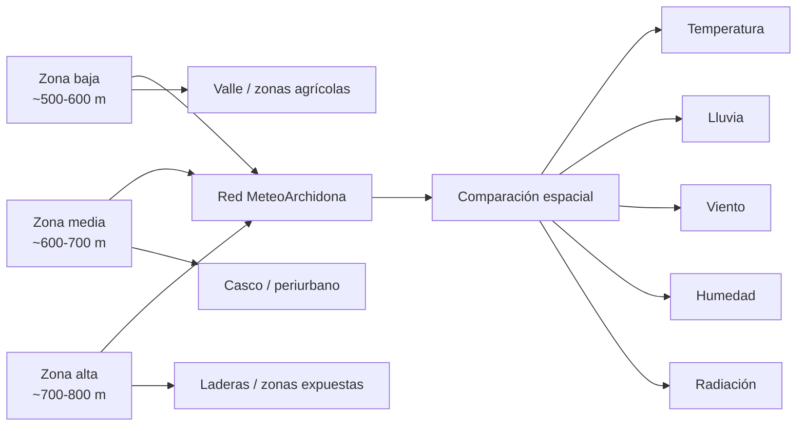
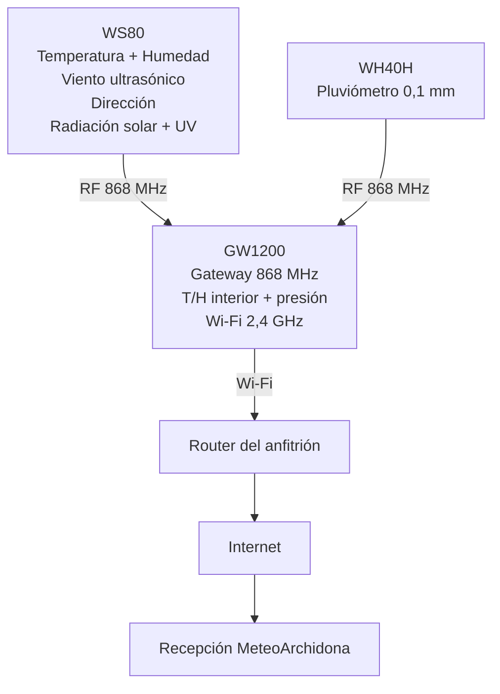

# Redimensionamiento de MeteoArchidona mediante nuevos puntos de medición

**Documento de planificación técnica**
**Proyecto:** MeteoArchidona
**Estado:** propuesta de redimensionamiento / estándar técnico v1
**Última revisión:** 3 de septiembre de 2026

---

## 1. Objetivo del documento

Este documento recoge la estrategia planteada para ampliar MeteoArchidona mediante una red de nuevos puntos de medición meteorológica distribuidos por Archidona, sus pedanías y zonas próximas de interés.

La idea parte de una necesidad clara: **una o dos estaciones de referencia no pueden representar por sí solas toda la variabilidad meteorológica de un territorio con una orografía tan marcada como la de Archidona**.

El objetivo no es sustituir las estaciones Davis Vantage Pro2 que ya forman parte de MeteoArchidona, sino complementarlas con una red secundaria de estaciones completas, de coste contenido, suficientemente fiables y fáciles de desplegar en casas, fincas o propiedades de familiares, amigos y colaboradores.

Este documento fija también una **configuración estándar inicial** para esos futuros puntos de medición:

> **Ecowitt GW1200 + Ecowitt WS80 + Ecowitt WH40H, versión Europa 868 MHz.**

La configuración queda definida como **estándar MeteoArchidona Ecowitt v1**, pendiente únicamente de la validación práctica de una primera unidad frente a una estación Davis de referencia.

---

## 2. Situación de partida

MeteoArchidona dispone ya de estaciones meteorológicas principales basadas en **Davis Vantage Pro2**, integradas mediante WeatherLink y conectadas a la infraestructura propia del proyecto.

Estas estaciones seguirán siendo puntos de referencia de alta calidad dentro de la red.

La ampliación propuesta introduce una segunda capa de observación formada por estaciones Ecowitt de coste mucho menor.

La estructura conceptual sería:

- **Estaciones principales de referencia:** Davis Vantage Pro2.
- **Red distribuida de nuevos puntos:** Ecowitt.
- **Persistencia común:** PostgreSQL de MeteoArchidona.
- **Acceso público común:** API propia de MeteoArchidona.

El consumidor final no deberá conocer si un dato procede originalmente de una Davis, una Ecowitt u otro proveedor futuro.

---

## 3. Por qué es necesaria una red más densa

Archidona presenta diferencias importantes de altitud y exposición en distancias muy pequeñas.

Dentro de un radio de pocos kilómetros se pueden encontrar cotas que van aproximadamente desde **500 metros hasta casi 800 metros de altitud**.

En una distancia del orden de cinco kilómetros pueden coexistir:

- fondos de valle;
- laderas;
- zonas altas;
- áreas urbanas;
- áreas periurbanas;
- zonas agrícolas abiertas;
- orientaciones diferentes respecto a las sierras;
- sectores más o menos expuestos al viento;
- lugares con distinta insolación;
- zonas con distinta respuesta pluviométrica.

Estas diferencias pueden traducirse en variaciones apreciables de:

- temperatura;
- humedad;
- inversión térmica;
- viento;
- precipitación;
- intensidad de lluvia;
- radiación solar;
- niebla y visibilidad.

La **pluviometría** tiene especial importancia para MeteoArchidona, ya que la distribución espacial de la lluvia puede variar significativamente incluso dentro del propio municipio.

### Representación conceptual



La finalidad no es acumular estaciones sin criterio, sino obtener **información meteorológica nueva en cada punto**.

---

## 4. Estrategia de despliegue

La expansión deberá apoyarse siempre que sea posible en ubicaciones donde exista colaboración local.

Un nuevo punto puede instalarse en:

- vivienda de un familiar;
- vivienda de un amigo o colaborador;
- finca agrícola;
- nave o instalación con suministro eléctrico;
- parcela con una ubicación meteorológicamente interesante;
- propiedad situada en una pedanía;
- instalación pública o privada que pueda colaborar en el futuro.

El anfitrión aporta principalmente:

1. ubicación;
2. conexión Wi-Fi de 2,4 GHz;
3. un punto de alimentación USB para el gateway;
4. permiso de instalación;
5. posibilidad de acceso para mantenimiento periódico.

Los sensores exteriores no requieren cableado de datos hasta la vivienda.

---

## 5. Zonas candidatas inicialmente identificadas

Durante la definición de esta estrategia han aparecido varios puntos que merecen estudiarse sobre mapa antes de cualquier compra o instalación.

Entre ellos:

- casco urbano de Archidona, con más de un punto si representan microclimas diferentes;
- Huertas del Río;
- Estación de Archidona;
- La Romera;
- Salinas / Estación de Salinas;
- Fuente del Fresno;
- otras pedanías y núcleos próximos;
- fincas situadas en distintas cotas y orientaciones.

Esta lista **no constituye todavía un plan de ubicaciones aprobado**.

Antes de desplegar cada nueva estación deberá comprobarse:

- altitud;
- coordenadas;
- orientación y exposición;
- distancia respecto a otros puntos de la red;
- calidad del emplazamiento para temperatura/humedad;
- calidad del emplazamiento para viento;
- calidad del emplazamiento para lluvia;
- cobertura RF entre sensores y gateway;
- disponibilidad de Wi-Fi;
- facilidad de mantenimiento.

La selección final deberá realizarse sobre un mapa de cobertura para evitar estaciones redundantes y priorizar vacíos de observación.

---

## 6. Referencia local que impulsa esta línea de trabajo

La investigación de estaciones meteorológicas locales mostró que **ArchidonaMeteo** utiliza desde hace tiempo diferentes equipos Ecowitt y mantiene varios puntos de observación publicados en Meteoclimatic.

Su estación **Archidona - Norte** figura públicamente con una configuración formada por:

- Ecowitt WS3820;
- Ecowitt WS80;
- Ecowitt WH40H;
- pluviómetro con resolución indicada de 0,1 mm.

Esta experiencia local es una referencia útil porque demuestra que Ecowitt puede emplearse en instalaciones meteorológicas serias sin asumir el coste de una Davis completa en cada punto.

MeteoArchidona no copiará exactamente esa instalación: para nuevas estaciones se propone el **GW1200**, gateway más reciente y sin pantalla, porque el proyecto no necesita una consola visual en cada vivienda.

### Posible coordinación futura

Durante la verificación de fuentes también aparece una publicación de ArchidonaMeteo en el foro de Meteoclimatic en la que se menciona un proyecto con el ayuntamiento para instalar varias estaciones en diferentes puntos de la localidad y pedanías.

Esto aconseja estudiar en el futuro una posible coordinación o colaboración para evitar duplicidades y aumentar la cobertura conjunta del territorio.

---

# 7. Estándar MeteoArchidona Ecowitt v1

## 7.1. Configuración elegida

La estación estándar propuesta queda formada por:

1. **Ecowitt GW1200** — gateway Wi-Fi sin pantalla.
2. **Ecowitt WS80** — conjunto principal de sensores exteriores.
3. **Ecowitt WH40H** — pluviómetro independiente de balancín.

Todos los equipos deberán adquirirse en versión:

> **Europa — 868 MHz**

No se mezclarán componentes de 433, 915 u otras frecuencias en una misma instalación europea.

---

## 7.2. Esquema físico de la estación



La separación física entre WS80 y WH40H es una ventaja: cada instrumento puede colocarse donde mejor mida su variable.

---

# 8. Ecowitt GW1200

<p align="center">
  
</p>

**Fabricante:** Ecowitt
**Modelo:** GW1200
**Función:** gateway inalámbrico Wi-Fi / concentrador de sensores
**Frecuencia para MeteoArchidona:** 868 MHz Europa

## Funciones principales

- recibe los sensores meteorológicos Ecowitt compatibles;
- integra temperatura interior;
- integra humedad interior;
- integra presión barométrica;
- conexión Wi-Fi 2,4 GHz;
- acceso a Ecowitt Cloud;
- admite servicios meteorológicos externos;
- admite servidor meteorológico personalizado compatible con protocolo Ecowitt o Weather Underground;
- actualización de firmware;
- soporte para dispositivos IoT adicional respecto al GW1100.

## Especificaciones principales

| Parámetro | Especificación |
|---|---|
| Dimensiones | 35 × 24,9 × 62 mm |
| Peso | 25 g |
| Temperatura interior | -9,9 a 60 °C |
| Precisión temperatura | ±1 °C |
| Resolución temperatura | 0,1 °C |
| Humedad interior | 1-99 % HR |
| Precisión humedad | ±5 % HR |
| Presión barométrica | 300-1100 hPa |
| Precisión presión | ±5 hPa |
| Resolución presión | 0,1 hPa |
| Actualización | aproximadamente 1 minuto |
| RF | 868 MHz en Europa |
| Alcance RF declarado | >100 m en espacio abierto |
| Wi-Fi | 802.11 b/g/n 2,4 GHz |
| Alimentación | USB 5 V / 1 A |

## Alimentación

El GW1200 necesita alimentación permanente mediante USB 5 V / 1 A.

El paquete incluye:

- gateway GW1200;
- cable alargador USB de 1,5 m;
- clip de cable;
- guía rápida.

**No incluye el adaptador de corriente 5 V / 1 A.**

## Precio de referencia

**31,99 USD** en la tienda oficial Ecowitt.
Equivalencia de referencia al 03/09/2026: **27,60 EUR**.

Producto oficial:
<https://shop.ecowitt.com/es-es/products/gw1200>

---

# 9. Ecowitt WS80

<p align="center">
  
</p>

**Fabricante:** Ecowitt
**Modelo:** WS80
**Función:** sensor exterior principal 6 en 1
**Frecuencia para MeteoArchidona:** 868 MHz Europa

## Variables medidas

- temperatura exterior;
- humedad exterior;
- velocidad del viento;
- velocidad de racha;
- dirección del viento;
- intensidad de luz/radiación solar;
- índice UV.

El viento se mide mediante tecnología **ultrasónica**, sin cazoletas mecánicas.

## Especificaciones principales

| Variable | Rango | Precisión declarada | Resolución |
|---|---:|---:|---:|
| Velocidad del viento | 0-40 m/s | ±0,5 m/s por debajo de 10 m/s; ±5 % a partir de 10 m/s | 0,1 m/s |
| Dirección | 0-359° | ±15° a partir de 10 m/s; fabricante deja pendiente el dato por debajo de 10 m/s | 1° |
| Temperatura | -40 a 60 °C | ±1 °C | 0,1 °C |
| Humedad | 1-99 % HR | ±5 % HR | 1 % |
| Luz | 0-300 klux | ±15 % | 10 lux |
| UV | 1-15 | ±2 | 1 |

## Transmisión

- frecuencia europea: **868 MHz**;
- alcance declarado en campo abierto: **150 m** para 868/915 MHz;
- intervalo de reporte: **4,8 segundos**.

La frecuencia de detección del viento aumenta cuando aumenta la velocidad del viento.

## Alimentación

El WS80 utiliza:

- **panel solar integrado de 6,5 V / 4 mA**;
- **2 pilas AA de litio de 1,5 V como respaldo**.

Las pilas no están incluidas.

## Montaje incluido

El equipo incluye elementos de fijación para poste, entre ellos:

- abrazaderas en U;
- tuercas;
- brazo de montaje;
- elementos de fijación indicados por el fabricante.

El mástil o estructura general de la instalación dependerá de cada ubicación.

## Precio de referencia

**109,99 USD** en la tienda oficial Ecowitt.
Equivalencia de referencia al 03/09/2026: **94,90 EUR**.

Producto oficial:
<https://shop.ecowitt.com/es-es/products/ws80>

---

# 10. Ecowitt WH40H

<p align="center">
  
</p>

**Fabricante:** Ecowitt
**Modelo:** WH40H
**Función:** pluviómetro inalámbrico independiente con autovaciado
**Frecuencia para MeteoArchidona:** 868 MHz Europa

## Razón de su elección

La pluviometría es uno de los parámetros prioritarios para la futura red.

Por ello se descarta depender del pluviómetro integrado de conjuntos más económicos como el WS69 y se adopta un instrumento específico con mejor resolución.

Ecowitt establece además al **WH40/WH40H como fuente prioritaria para precipitación tradicional** cuando está conectado a un gateway junto a otros sensores compatibles.

## Especificaciones principales

| Parámetro | Especificación |
|---|---|
| Rango acumulado | 0-9999 mm |
| Resolución | **0,1 mm** |
| Precisión declarada | ±5 % |
| Intervalo de reporte | aproximadamente 49 s |
| Alcance RF declarado | >100 m en espacio abierto |
| Temperatura de funcionamiento | -40 a 60 °C |
| Protección | IPX4 |
| Dimensiones | 189 × 189 × 194 mm |
| Peso | 583,3 g |

## Alimentación

- **1 pila AA alcalina de 1,5 V**;
- autonomía declarada aproximada: **1 año**.

La pila no está incluida.

## Elementos incluidos

El paquete incorpora, entre otros:

- filtro de acero inoxidable;
- 15 púas antiaves;
- abrazaderas en U;
- placa metálica de montaje;
- tornillería.

## Precio de referencia

**39,99 USD** en la tienda oficial Ecowitt.
Equivalencia de referencia al 03/09/2026: **34,50 EUR**.

Producto oficial:
<https://shop.ecowitt.com/es-es/products/wh40h>

---

# 11. Presupuesto estándar por punto de medición

Los siguientes precios corresponden a la tienda oficial Ecowitt y fueron comprobados el **3 de septiembre de 2026**.

Para la equivalencia orientativa se ha usado un cambio de referencia de:

> **1 USD = 0,86283 EUR**

| Componente | Precio USD | Equivalencia EUR aprox. |
|---|---:|---:|
| Ecowitt GW1200 | 31,99 USD | 27,60 EUR |
| Ecowitt WS80 | 109,99 USD | 94,90 EUR |
| Ecowitt WH40H | 39,99 USD | 34,50 EUR |
| **TOTAL NÚCLEO METEOROLÓGICO** | **181,97 USD** | **157,01 EUR** |

## Elementos necesarios no incluidos todavía en el presupuesto cerrado

Cada punto necesitará también:

- 1 adaptador USB 5 V / 1 A para el GW1200;
- 2 pilas AA de litio de 1,5 V para el WS80;
- 1 pila AA para el WH40H;
- mástil, poste o estructura cuando la ubicación no disponga ya de uno adecuado;
- elementos auxiliares de fijación cuando sean necesarios;
- transporte/envío.

Los WS80 y WH40H ya incorporan parte de sus herrajes de fijación.

Estos elementos **no se fijan todavía a una marca o precio estándar** porque dependerán parcialmente de cada emplazamiento.

Por tanto, el presupuesto cerrado en esta versión del documento es:

> **157,01 EUR aproximadamente por el núcleo meteorológico estándar de cada nuevo punto, antes de portes y elementos específicos de instalación.**

Cuando se compre la primera unidad se documentará el coste real completo puesto en Archidona y se actualizará este apartado para convertirlo en presupuesto de despliegue definitivo.

---

# 12. Decisiones descartadas

## 12.1. Una Davis Vantage Pro2 en cada ubicación

No se considera económicamente razonable para una red densa.

Las Davis existentes seguirán siendo estaciones principales de referencia, pero no es necesario replicar su coste en todos los futuros puntos.

## 12.2. Ecowitt WS69 como estación estándar

Puede resultar más barato, pero se ha preferido una configuración modular con:

- viento ultrasónico mediante WS80;
- pluviómetro WH40H dedicado de 0,1 mm.

## 12.3. Garita Davis adicional para temperatura/humedad

Descartada por coste.

No tiene sentido, para esta estrategia de despliegue, gastar en una garita una cantidad comparable o incluso superior al coste del conjunto principal de sensores.

## 12.4. Garitas artesanales de platos

Descartadas.

MeteoArchidona no quiere basar una futura red estándar en soluciones artesanales fabricadas apilando platos o elementos de plástico.

## 12.5. Garita comercial económica adicional desde el primer día

No se comprará inicialmente.

La decisión es utilizar primero la protección de temperatura/humedad integrada en el WS80 y **medir su comportamiento real frente a una Davis Vantage Pro2**.

Solo si la comparación demuestra una desviación problemática se estudiará un sensor separado y una protección adicional.

---

# 13. Validación de la primera unidad

Antes de desplegar varias estaciones Ecowitt se comprará e instalará una primera unidad piloto.

La prueba deberá realizarse temporalmente en un emplazamiento donde pueda compararse con una de las Davis de MeteoArchidona, preferiblemente en El Silo.

## Variables a comparar

- temperatura exterior;
- humedad exterior;
- presión;
- velocidad del viento;
- rachas;
- dirección;
- radiación solar;
- UV;
- lluvia acumulada;
- intensidad/tasa de lluvia cuando sea posible.

## Prueba específica de temperatura

Se prestará especial atención a:

- horas centrales de días despejados;
- radiación solar elevada;
- situaciones con viento débil;
- máximas diarias;
- noches en calma.

El objetivo será determinar con datos propios si la protección integrada del WS80 es suficiente para la red secundaria.

No se fija todavía un umbral de aceptación sin disponer de medidas reales.

## Prueba específica de pluviometría

El WH40H deberá compararse evento a evento con el pluviómetro de la Davis.

Se analizarán:

- episodios débiles;
- lluvia moderada;
- episodios intensos;
- acumulados diarios;
- acumulados mensuales cuando exista serie suficiente.

La prioridad será comprobar que el WH40H ofrece una calidad adecuada para el objetivo principal de densificar la observación pluviométrica del territorio.

---

# 14. Integración con MeteoArchidona

La incorporación de Ecowitt no debe alterar la arquitectura general del proyecto.

El proveedor de adquisición podrá cambiar, pero el modelo propio y los consumidores seguirán siendo independientes.

## Arquitectura prevista


## Principio obligatorio

Los clientes públicos no consultarán directamente WeatherLink ni Ecowitt.

El flujo seguirá siendo:

> **Proveedor → adquisición → normalización → PostgreSQL → API propia → consumidores.**

El usuario de la API no debería necesitar conocer qué marca de estación originó una observación.

---

# 15. Posible recepción directa desde GW1200

Ecowitt documenta en el GW1200 compatibilidad con:

- Ecowitt Weather;
- Weather Underground;
- Weathercloud;
- WOW;
- servidor meteorológico personalizado compatible con protocolo Ecowitt o Weather Underground.

Esto abre la posibilidad de que cada GW1200 envíe datos hacia una futura infraestructura de recepción de MeteoArchidona.

La arquitectura objetivo sería:

```text
Sensores Ecowitt
      ↓ 868 MHz
GW1200
      ↓ Wi-Fi / Internet
Receptor Ecowitt de MeteoArchidona
      ↓
Normalización
      ↓
PostgreSQL
      ↓
API MeteoArchidona
```

La implementación concreta queda pendiente de una fase técnica específica.

Antes de desarrollarla deberá verificarse:

- protocolo exacto de envío;
- campos transmitidos;
- autenticación disponible;
- comportamiento ante pérdida de Internet;
- reintentos;
- idempotencia;
- seguridad del transporte;
- identificación inequívoca de cada estación;
- preservación del payload original;
- frecuencia adecuada de persistencia.

No se diseñará la recepción definitiva hasta disponer de un GW1200 real para pruebas.

---

# 16. Instalación física recomendada

La modularidad permite separar los sensores según las necesidades de cada variable.

## WS80

Debe buscarse una ubicación:

- despejada;
- con buena exposición al viento;
- alejada de obstáculos relevantes;
- con suficiente exposición solar para su alimentación;
- dentro del alcance RF del GW1200.

## WH40H

Debe priorizarse:

- horizontalidad correcta;
- ausencia de obstáculos cercanos que apantallen la lluvia;
- facilidad de limpieza;
- acceso para mantenimiento;
- separación de paredes, tejados y elementos que produzcan salpicaduras o turbulencias.

No es necesario colocar el pluviómetro en el mismo punto físico que el anemómetro.

## GW1200

Debe instalarse:

- en interior o zona protegida;
- con alimentación USB permanente;
- dentro de cobertura Wi-Fi 2,4 GHz;
- en una posición que mantenga buena comunicación RF con WS80 y WH40H.

---

# 17. Alimentación y mantenimiento

## GW1200

- USB 5 V / 1 A permanente.

## WS80

- panel solar integrado;
- 2 pilas AA de litio de respaldo.

## WH40H

- 1 pila AA;
- autonomía declarada aproximada de un año.

## Mantenimiento periódico

Cada punto debería incorporar una rutina mínima de mantenimiento:

- inspección del pluviómetro;
- retirada de hojas, suciedad o insectos;
- comprobación de nivelación;
- revisión de fijaciones;
- comprobación de estado de baterías;
- verificación de señal RF;
- verificación de conectividad Wi-Fi;
- comparación periódica de valores anómalos con estaciones próximas.

---

# 18. Datos interiores y privacidad

El GW1200 incorpora sensores de temperatura y humedad interior.

En una estación instalada en una vivienda ajena, estos valores pueden describir condiciones del interior de una casa particular.

Por tanto, antes del despliegue masivo deberá fijarse una política específica sobre:

- si se reciben esos campos;
- si se persisten;
- si se utilizan solo para diagnóstico;
- si se publican o no;
- consentimiento del propietario/anfitrión.

Como criterio inicial de prudencia, **los datos interiores de viviendas de colaboradores no deberían publicarse por defecto**.

---

# 19. Criterios para aprobar una nueva ubicación

Un emplazamiento debería añadirse a la red cuando aporte valor meteorológico real.

Se valorará:

1. **Cobertura geográfica:** llena un vacío de la red.
2. **Altitud:** representa una cota distinta.
3. **Orografía:** valle, ladera, zona alta, etc.
4. **Exposición:** aporta una orientación diferente.
5. **Pluviometría:** puede representar un sector con respuesta distinta a la lluvia.
6. **Calidad del emplazamiento:** permite instalar correctamente los sensores.
7. **Conectividad:** dispone de Wi-Fi estable y alimentación.
8. **Mantenimiento:** existe una persona o acceso razonable para atender la estación.
9. **Redundancia:** no duplica innecesariamente otro punto próximo con características equivalentes.

---

# 20. Fases propuestas

## Fase 1 — Prototipo

Comprar una única estación estándar:

> **GW1200 + WS80 + WH40H — 868 MHz.**

Instalarla temporalmente junto a una Davis y validar mediciones.

## Fase 2 — Integración Ecowitt

Desarrollar el adaptador/receptor necesario para que los datos entren en la arquitectura propia de MeteoArchidona.

## Fase 3 — Primeras ubicaciones reales

Seleccionar varios emplazamientos que representen microclimas diferentes.

## Fase 4 — Mapa de cobertura

Representar todas las estaciones con:

- coordenadas;
- altitud;
- tipo de entorno;
- variables disponibles;
- estado de conexión;
- calidad del emplazamiento.

## Fase 5 — Expansión progresiva

Añadir nuevos puntos únicamente cuando aporten cobertura nueva o redundancia meteorológicamente útil.

---

# 21. Posibles ampliaciones futuras de cada punto

El estándar v1 no impide añadir sensores adicionales más adelante.

El ecosistema GW1200 admite, entre otros, sensores Ecowitt para:

- temperatura/humedad exterior independiente;
- calidad del aire;
- partículas PM2.5;
- rayos;
- humedad del suelo;
- humedad foliar;
- temperatura de suelo;
- otros parámetros ambientales.

Estas ampliaciones no forman parte del presupuesto estándar actual.

También podría estudiarse en determinados puntos la instalación conjunta de una **cámara meteorológica**, pero la cámara sería un subsistema independiente y no forma parte de la estación estándar v1.

---

# 22. Decisión actual

A fecha de esta revisión queda adoptada como **configuración técnica de referencia para estudiar futuros puntos de medición**:

> ## MeteoArchidona Ecowitt v1
> **GW1200 + WS80 + WH40H — 868 MHz Europa**

Características fundamentales de la decisión:

- estación completa;
- sin consola con pantalla;
- bajo coste;
- temperatura y humedad;
- viento ultrasónico;
- dirección;
- radiación solar;
- UV;
- presión mediante gateway;
- pluviómetro independiente de 0,1 mm de resolución;
- sensores exteriores inalámbricos;
- capacidad de integración con servidor meteorológico personalizado;
- apta para una red geográficamente densa.

El estándar se considerará **validado** cuando una primera unidad haya sido comparada satisfactoriamente con una Davis de referencia de MeteoArchidona.

---

# 23. Fuentes técnicas y precios

Fuentes consultadas y verificadas el 03/09/2026:

### Ecowitt GW1200

- Producto y especificaciones oficiales:
  <https://shop.ecowitt.com/es-es/products/gw1200>
- Documentación Ecowitt:
  <https://www.ecowitt.com/api/quickstart/product?id=299>

### Ecowitt WS80

- Producto y especificaciones oficiales:
  <https://shop.ecowitt.com/es-es/products/ws80>

### Ecowitt WH40H

- Producto y especificaciones oficiales:
  <https://shop.ecowitt.com/es-es/products/wh40h>

### Referencia local ArchidonaMeteo / Meteoclimatic

- Archidona - Norte:
  <https://www.meteoclimatic.net/perfil/ESAND2900000029300B>
- PFV Guadacano:
  <https://www.meteoclimatic.net/perfil/ESAND2900000029300C>
- Foro Meteoclimatic, inventario público de equipos de ArchidonaMeteo:
  <https://forum.meteoclimatic.net/index.php?topic=5880.0>
- Referencia pública al proyecto de varias estaciones en localidad y pedanías:
  <https://forum.meteoclimatic.net/index.php?topic=3232.390>

### Tipo de cambio de referencia

- 1 USD = 0,86283 EUR.
- Consulta realizada el 03/09/2026.

---

# 24. Próximos trabajos pendientes

- [ ] Comprar una primera unidad GW1200 + WS80 + WH40H 868 MHz.
- [ ] Registrar coste real final incluyendo envío.
- [ ] Estandarizar adaptador USB y pilas.
- [ ] Definir mástil/soportes estándar cuando sea posible.
- [ ] Realizar comparación controlada frente a Davis.
- [ ] Analizar especialmente pluviometría y temperatura con alta radiación.
- [ ] Diseñar integración Ecowitt → MeteoArchidona.
- [ ] Definir seguridad y autenticación de recepción.
- [ ] Definir política de datos interiores en viviendas colaboradoras.
- [ ] Crear mapa de ubicaciones candidatas.
- [ ] Contactar/coordinar con colaboradores potenciales antes de fijar ubicaciones.
- [ ] Valorar coordinación con redes meteorológicas locales ya existentes.
- [ ] Actualizar este documento después de la validación del prototipo.

---

## Conclusión

El redimensionamiento de MeteoArchidona no tiene por qué basarse en multiplicar estaciones Davis de alto coste.

Una red híbrida permite mantener estaciones de referencia de alta calidad y, al mismo tiempo, desplegar numerosos puntos de observación completos allí donde la orografía y la meteorología local hagan que una nueva medición aporte información real.

La combinación **GW1200 + WS80 + WH40H** ofrece, sobre el papel, un equilibrio especialmente atractivo entre coste, número de variables, modularidad, facilidad de instalación y capacidad de integración.

Si la primera unidad supera la validación frente a una Davis, este conjunto podrá convertirse en la base de una red MeteoArchidona mucho más densa, capaz de representar mejor los contrastes meteorológicos del municipio, sus pedanías y su entorno.